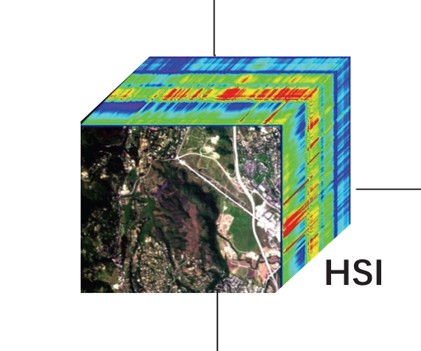
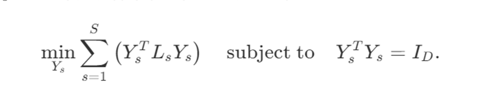
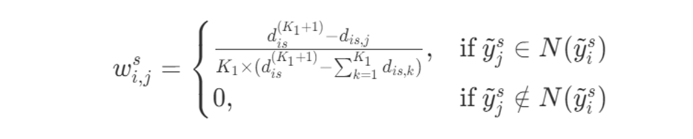
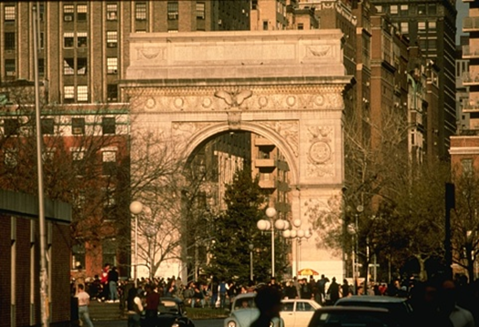
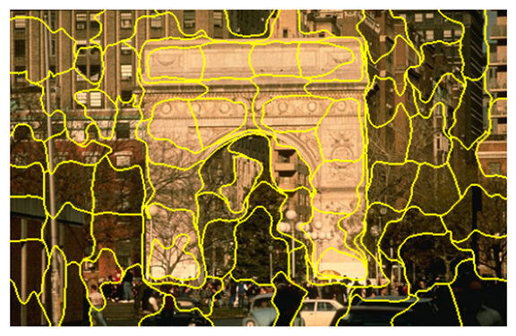
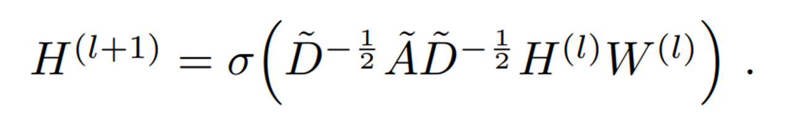
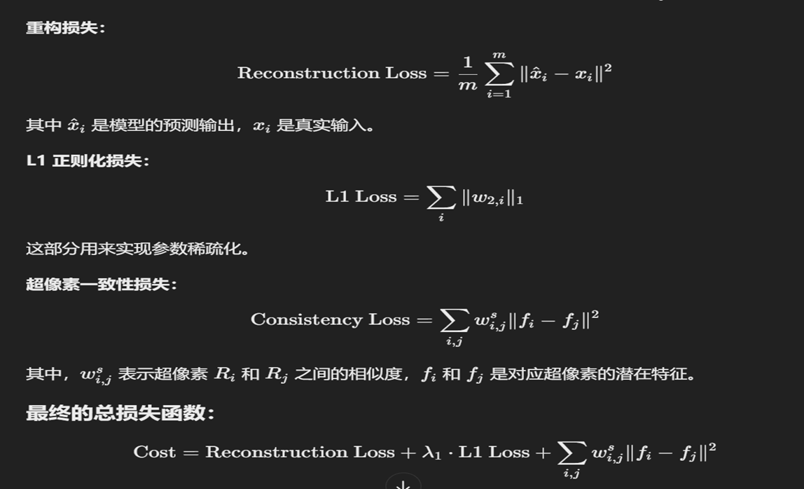
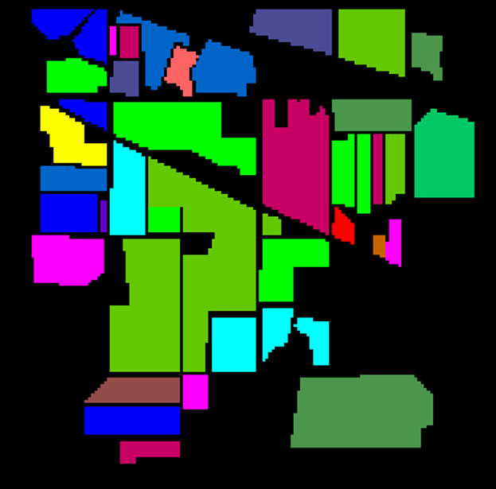
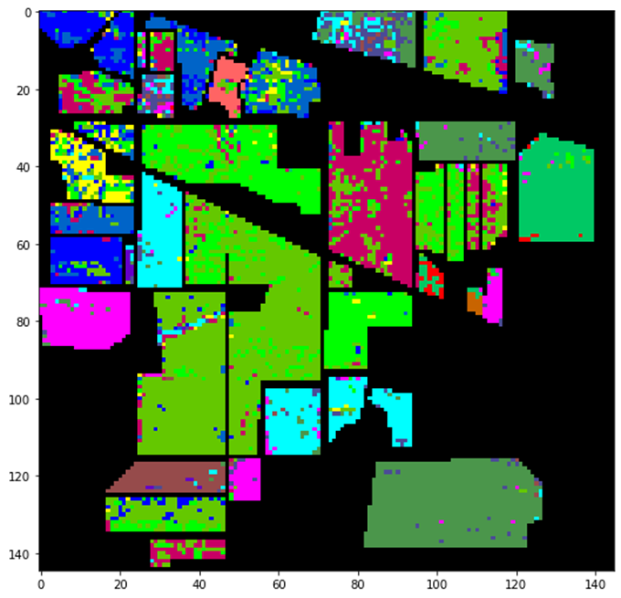

# 基于超像素分割的图卷积神经网络实现高光谱波段选择 🌈

## 高光谱数据简介 📡

高光谱图像通过遥感技术捕捉地物在多个连续光谱波段中的反射或发射信息。这些图像包含数十到数百个波段，能够提供丰富的地物信息。相比RGB图像，高光谱图像能够细致地区分物质的光谱特性，因此在农业、环境监测、矿产勘探等领域应用广泛。

然而，高光谱数据面临以下挑战：
- **高维数据**：波段数量庞大，冗余信息较多。
- **小样本问题**：样本数量有限，难以充分训练深度学习模型。
- **计算负担大**：高维数据处理需要较高的计算资源。

因此，**波段选择**技术应运而生，它能够从原始波段中选出最具代表性的子集，减少冗余信息的同时保留足够的地物信息。

## 主流波段选择方法 🔍

波段选择方法通常可以分为五类：

1. **基于排序的方法**：利用特定准则对波段进行排序，选择前几个波段。这类方法容易受准则函数影响，且波段之间相似性较高。
   
2. **基于搜索的方法**：通过搜索策略找到最优波段组合，如线性预测法（LP）和体积梯度快速波段选择（VGBS）。此方法效果较好，但计算成本较高。

3. **基于聚类的方法**：将波段分为簇，从每个簇中选择波段。虽然减少了冗余，但会受到噪声的干扰。

4. **基于稀疏表示的方法**：将波段选择问题建模为稀疏约束优化问题，如SpaBS和NWSR。这些方法对优化方法依赖较强，且结果可能不稳定。

5. **深度学习方法**：利用深度学习自动学习特征进行波段选择。深度学习方法能够捕捉复杂的模式，比传统方法更具优势。

## 相关工作 🔬

### 超像素分割与潜在特征矩阵的提取 ✂️

我们结合了 **ERS算法**（超像素分割）和 **LE技术**（拉普拉斯特征提取）来优化特征提取。ERS算法将高光谱图像分割成多个光谱相似的超像素，通过这种方式捕捉图像的空间结构。接着，LE技术从每个超像素中提取关键特征，形成潜在特征矩阵。

这种方法有效减少了噪声，并降低了数据维度，提升了模型的效率和表现。

#### 核心公式 📐

超像素分割和拉普拉斯特征提取的核心公式如下：

通过拉普拉斯矩阵，我们能够提取出包含更多数据结构信息的特征向量，从而提升了特征提取的质量。

#### 效果展示 🖼️

以下是超像素分割和特征提取的效果图：

- **超像素分割效果**：
  

- **潜在特征提取效果**：
  

### 图卷积网络 (GCN) 的传播规则 📉

我们利用 **图卷积神经网络（GCN）** 来处理图结构数据。图卷积操作通过邻接矩阵传播节点信息，捕捉节点及其邻域的局部结构。GCN的传播规则如下：

其中：
- **H**：输入的特征矩阵
- **A**：图的邻接矩阵
- **W**：训练的权重矩阵
- **D**：度矩阵

图卷积通过聚合节点邻域信息，使得每个节点的表示更加丰富，从而提升了分类效果。
## 我们的工作
### **损失函数设计**：
  

### 效果展示 🎨

通过图卷积网络和特征提取方法的结合，我们能够从高光谱数据中选择出最具代表性的波段。以下是波段选择和分类结果的展示：
- **原始图像**：
  
- **分类图像**：
  

## 结论 🎯

本项目提出了一种基于超像素分割和图卷积神经网络的高光谱波段选择方法。与传统方法相比，该方法能够：
- 更有效地降低高光谱数据的维度。
- 保留关键信息，减少计算负担。
- 提高分类精度，适应复杂数据环境。（还没有实现）

这种方法为高光谱图像分析提供了一种新的思路，具有广泛的应用潜力，尤其是在遥感监测、环境保护等领域。

## 未来工作 🚀

- **优化网络结构**：探索更复杂的图卷积网络结构，以进一步提升性能。
- **跨领域应用**：将该方法推广至其他领域的高维数据分析，如医学影像处理、遥感图像分析等。

---

## 本项目依据于青岛大学2022级图灵班的大创项目

### 主要代码框架为基于pytorch实现的深度子空间聚类的波段选择（已舍弃）

## tensorflow版本
[Orginal code](https://github.com/panji1990/Deep-subspace-clustering-networks).

# 模型完善迭代过程
## 2024.9.16：实现了使用SVM选择波段同时验证分类效果的功能

## 2024年九月下旬 更改研究方向，模型框架更改为基于图卷积神经网路的波段选择

## 2024.9.29 复现了基于GCN的高光谱图像分类代码
## 2024.10.7 复现了基于GCN的高光谱图像的波段选择代码 
## 2024.11.1 确定下一步的方向为超像素分割的图卷积，同时实现了熵率分割的代码

## 2024.12.7 对现有的图卷积神经网络进行改变，添加上不同的约束（波段和像素点上的）

